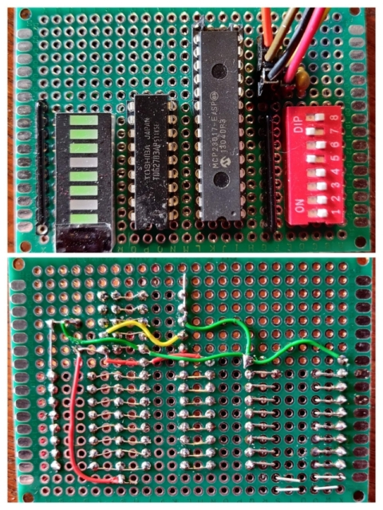

# Pico2040-MC23017-Modbus
Testing Pico2040 with MCP23017 i2c port extender with Modbus RTU over USB  link



Using MCP23017 and Modbus-Serial libraries 

Communicating with PC using mbpoll software.

[mbpoll](https://github.com/epsilonrt/mbpoll)


## Arduino software

[Demo](./Software/Pico-MCP23017-Modbus/Pico-MCP23017-Modbus.ino)

## Test commands

### Read remote device information

```
david@I7MINT:~$ mbpoll -m rtu -b115200 -a10 -t0   -u /dev/ttyACM0
mbpoll 1.4-12 - FieldTalk(tm) Modbus(R) Master Simulator
Copyright © 2015-2019 Pascal JEAN, https://github.com/epsilonrt/mbpoll
This program comes with ABSOLUTELY NO WARRANTY.
This is free software, and you are welcome to redistribute it
under certain conditions; type 'mbpoll -w' for details.

Protocol configuration: Modbus RTU
Slave configuration...: address = 10, report slave id
Communication.........: /dev/ttyACM0,     115200-8E1 
                        t/o 1.00 s, poll rate 1000 ms
Length: 10
Id    : 0x00
Status: On
Data  : MCP23017

```
### Write to coil registers (LEDs)

```
david@I7MINT:~$ mbpoll -m rtu -b38400 -a10 -t0 -r1 /dev/ttyACM0 1 0 1 1 0 1 1 1 
mbpoll 1.4-12 - FieldTalk(tm) Modbus(R) Master Simulator
Copyright © 2015-2019 Pascal JEAN, https://github.com/epsilonrt/mbpoll
This program comes with ABSOLUTELY NO WARRANTY.
This is free software, and you are welcome to redistribute it
under certain conditions; type 'mbpoll -w' for details.

Protocol configuration: Modbus RTU
Slave configuration...: address = [10]
                        start reference = 1, count = 8
Communication.........: /dev/ttyACM0,      38400-8E1 
                        t/o 1.00 s, poll rate 1000 ms
Data type.............: discrete output (coil)

Written 8 references.
```
### Read from input registers (switches)

```
david@I7MINT:~$ mbpoll -m rtu -b115200 -a10 -t1 -1  -c 8  /dev/ttyACM0
mbpoll 1.4-12 - FieldTalk(tm) Modbus(R) Master Simulator
Copyright © 2015-2019 Pascal JEAN, https://github.com/epsilonrt/mbpoll
This program comes with ABSOLUTELY NO WARRANTY.
This is free software, and you are welcome to redistribute it
under certain conditions; type 'mbpoll -w' for details.

Protocol configuration: Modbus RTU
Slave configuration...: address = [10]
                        start reference = 1, count = 8
Communication.........: /dev/ttyACM0,     115200-8E1 
                        t/o 1.00 s, poll rate 1000 ms
Data type.............: discrete input

-- Polling slave 10...
[1]: 	1
[2]: 	1
[3]: 	1
[4]: 	1
[5]: 	0
[6]: 	1
[7]: 	0
[8]: 	1
```
